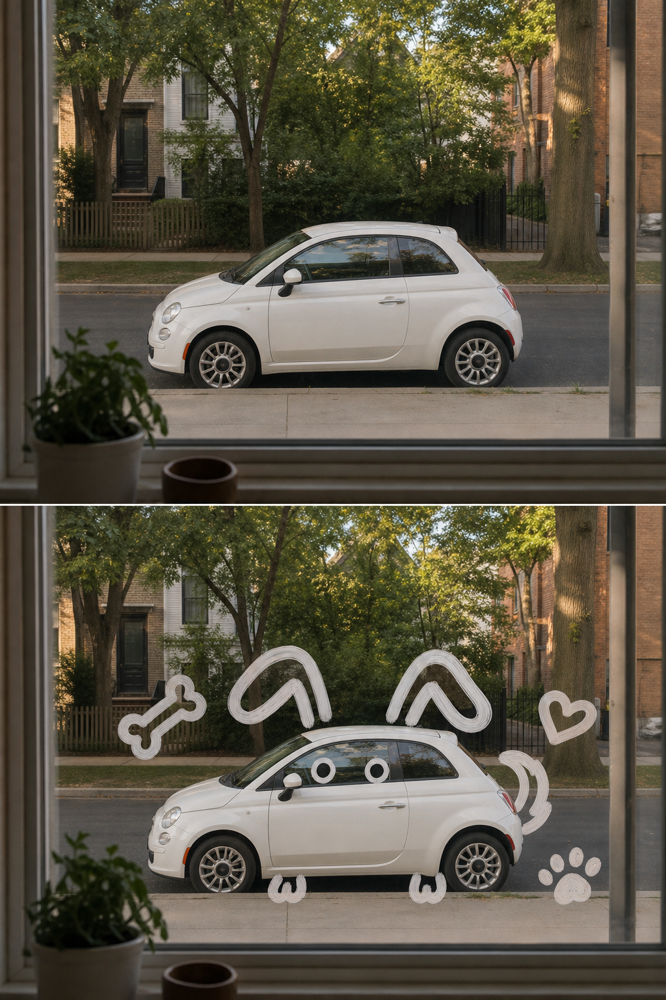

# 玻璃涂鸦双联海报 / Glass Doodle Overlay Poster

一个 Codex 生图编辑 skill：将每张上传照片各自制作成固定 3:4 的上下双联海报。上半保留真实照片，下半在近处玻璃表面用极粗白色线条补画，让主体自然呈现“它看起来像……”的可爱联想效果。

A Codex image-editing skill that makes every uploaded photo into an independent fixed 3:4 two-panel poster: retain the real photograph above, then use thick white foreground-glass doodles below to make one subject read as a cute imagined character or object.

## 效果 / What it creates

每张上传照片独立输出，绝不多图拼接。海报为严格 3:4 竖版，上下两部分高度严格 1:1、各占 50%。上半保留原图的主体结构、真实质感、自然光影和色彩氛围，仅做轻微高级摄影调色；下半复用同一场景进行玻璃涂鸦叠画。

Each upload produces one independent poster—never a multi-photo collage. The exact 3:4 vertical layout has two equal-height 50% panels. The upper panel preserves the photo with subtle premium editorial grading; the lower panel reuses the same scene for the glass-doodle overlay.

下半部分始终维持清晰的空间层次 / The lower panel always protects the depth order:

`玻璃表面手绘线条 → 窗外真实主体 → 原始环境背景`
`foreground glass doodle → real subject outdoors → original background`

主体附近默认会补充 1–5 个与想象形象强相关的极简白色小图标；只有用户明确要求时才不添加。效果避免修改主体、厚重雾气、水汽、复杂插画、细线稿、文字、UI 元素和水印。

The lower panel adds 1–5 tiny white icons strongly related to the imagined form near the subject by default, unless the user explicitly opts out. It avoids replacing the subject, fogging the window, intricate illustration, thin lines, captions, UI elements, and watermarks.

## 效果预览 / Preview

上半保留照片的真实场景与轻微杂志调色；下半使用同一场景，通过玻璃上的白色粗笔涂鸦，将小车联想成小狗。

The upper panel remains a lightly graded real photo; the lower panel uses the same scene and turns the car into a puppy-like visual association with bold white window-marker doodles.



## 安装 / Install

将仓库克隆至 Codex skills 目录 / Clone the repository into a Codex skill directory:

```bash
git clone https://github.com/hyt24/glass-doodle-overlay.git \
  ~/.codex/skills/glass-doodle-overlay
```

也可以复制到项目本地技能目录，例如 `.agents/skills/glass-doodle-overlay`。

Or copy this folder to a project-local skill directory such as `.agents/skills/glass-doodle-overlay`.

如果没有立即出现，请重启或刷新 Codex。 / Restart or refresh Codex if the skill does not appear immediately.

## 使用 / Use

上传照片后调用 skill，并说明真实主体和要联想的形象。多张照片将自动分别输出。 / Attach photos and invoke the skill, specifying the real subject and the imagined form; multiple uploads are output separately:

```text
使用 $glass-doodle-overlay：把窗外那辆白色小车想象成一只小狗；每张图做成 3:4 上下等高海报，上半保留原图，下半做玻璃涂鸦。
```

```text
Use $glass-doodle-overlay: make each uploaded photo a 3:4 equal-height two-panel poster; keep the photo above and make the cloud read as a whale through thick white glass doodles below.
```

## 文件说明 / Included files

- `SKILL.md` — 工作流、编辑规则和质量检查 / workflow, editing rules, and quality checks.
- `references/style-guide.md` — 原图保持、固定版式与涂鸦视觉规范 / scene preservation, fixed layout, and doodle art direction.
- `references/prompt-template.md` — 可复用的生图提示词模板 / a reusable generation prompt template.
- `agents/openai.yaml` — Codex 界面元数据 / Codex UI metadata.

## 许可证 / License

MIT. See [LICENSE](LICENSE).
